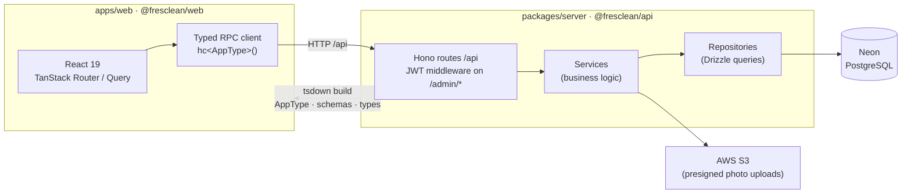

# Fresclean


Bun monorepo for a laundry/cleaning service business: a REST API and an admin web dashboard.

| Package | Name | Path | Description |
| --- | --- | --- | --- |
| Server | `@fresclean/api` | [`packages/server`](packages/server) | Hono REST API with Drizzle ORM (PostgreSQL via Neon) |
| Web | `@fresclean/web` | [`apps/web`](apps/web) | React 19 + Vite admin dashboard |

The web app consumes the server package as a workspace dependency for shared types, Zod schemas, and a typed RPC client (Hono `hc<AppType>()`).

## Architecture



End-to-end type safety with no codegen: the server exports its Hono `AppType` and Zod schemas, `tsdown` bundles them into the workspace package, and the web app gets fully typed API calls, request validation, and form schemas from a single source of truth.

Domain logic on the server follows a 3-layer module pattern — thin HTTP routes call **services** (domain verbs: `createOrder`, `getShift`), which orchestrate **repositories** (DB verbs: `insertOrder`, `findShiftById`).

## Quick Start

```sh
bun install        # Install all workspace dependencies
bun run dev        # Build API types, then start server (:8000) + web (:5173)
```

## Scripts

Tasks are orchestrated by Turborepo and run across all packages:

```sh
bun run build         # Build all packages (cached)
bun run lint          # Lint all packages (cached)
bun run type-check    # Type-check all packages (cached)
```

Linting/formatting uses [Ultracite](https://ultracite.ai) (Biome preset) — run `bun x ultracite fix` from the repo root. Husky runs Biome on staged files before every commit.

## Environment Variables

The server reads from `process.env` (`.env` in `packages/server`):

- `DATABASE_URL_DEV` / `DATABASE_URL_PROD` — Neon PostgreSQL connection strings
- `JWT_SECRET` — secret key for JWT authentication

## Docs

- [`CLAUDE.md`](CLAUDE.md) / `AGENTS.md` — architecture, conventions, common tasks
- [`CONTEXT.md`](CONTEXT.md) — domain glossary and relationships
- [`docs/adr/`](docs/adr) — architecture decision records
